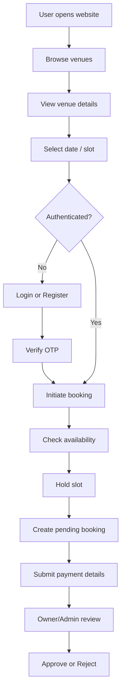
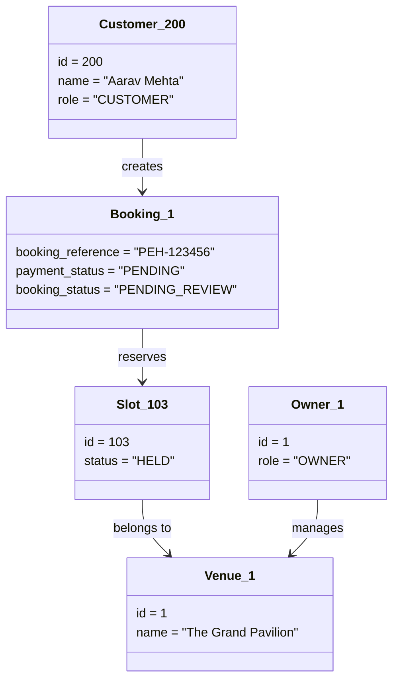
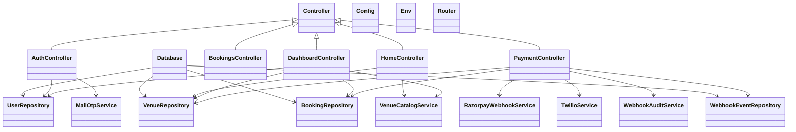
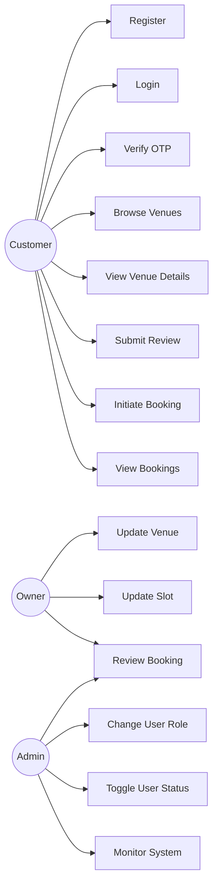
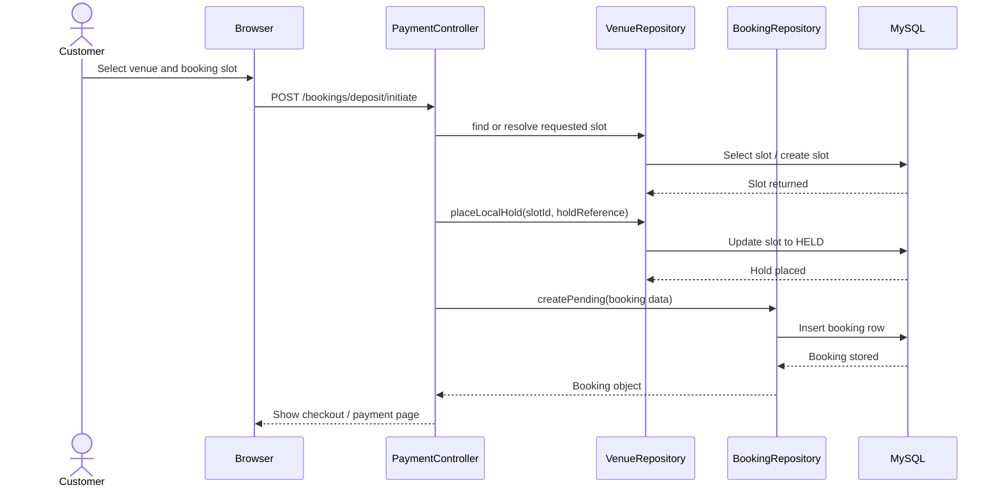
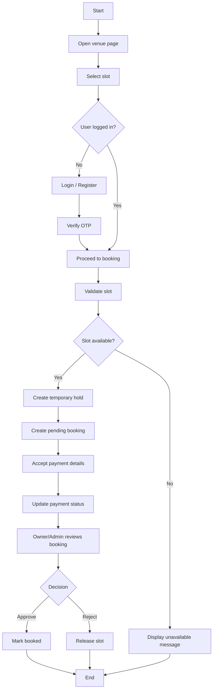
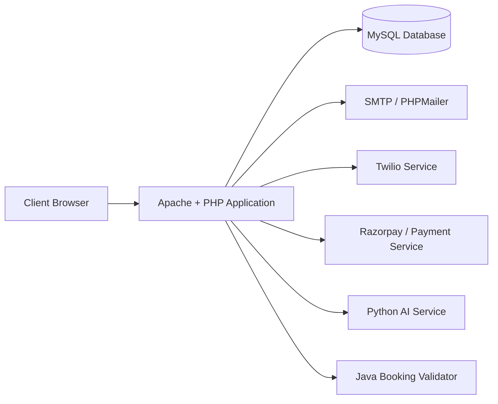
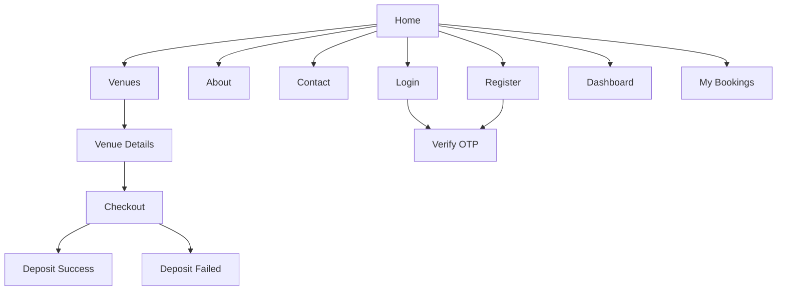
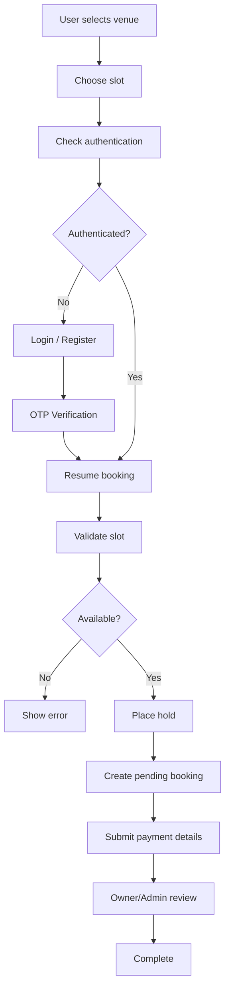

# EMS2 Detailed Project Report

## INDEX

### CHAPTER 1: INTRODUCTION

1.1 Introduction  
1.2 Existing System and Need for the System  
1.3 Scope of Work  
1.4 Operating Environment - Hardware and Software  
1.5 Detailed Description of the Technology Used  

### CHAPTER 2: SOFTWARE REQUIREMENT SPECIFICATION AND PROPOSED SYSTEM

2.1 Proposed System  
2.2 Objectives of System  
2.3 User Requirements  
2.3.1 Overall Description  
2.3.2 Specific Requirements  
2.3.3 Other Non-functional Requirements  

### CHAPTER 3: ANALYSIS AND DESIGN

3.1 System Flow Diagram (CLD / System Level Use Case)  
3.2 Object Diagram  
3.3 List of Classes and Class Diagram  
3.4 List of Use Cases and Use Case Diagrams  
3.5 Sequence Diagram  
3.6 Activity Diagram  
3.7 Deployment Diagram  
3.8 Website Map Diagram  

### CHAPTER 4: IMPLEMENTATION AND USER MANUAL

4.1 User Interface Design  
4.2 Program Specifications / Flow Charts  
4.3 Code Snippet (Database Connectivity)  
4.4 Test Procedures, Test Cases and Implementation  
4.5 User Manual  
4.6 Operations Manual / Menu Explanation  

### FINAL SECTIONS

Drawbacks and Limitations of Proposed System  
Enhancements  
Conclusion  
Bibliography  

### ANNEXURES

Annexure 1: Input Forms with Data  
Annexure 2: Output Reports with Data  
Annexure 3: Sample Code  

---

# CHAPTER 1: INTRODUCTION

## 1.1 Introduction

Event management has become an important part of modern social and business life. Functions such as weddings, birthday celebrations, conferences, receptions, exhibitions, product launches, concerts, and corporate meetings require proper venue planning and scheduling. Traditionally, venue booking is often handled manually through phone calls, face-to-face inquiries, spreadsheets, notebooks, or informal communication channels. This process is time-consuming, inefficient, and highly prone to human error. Customers frequently face difficulty in identifying suitable venues, comparing prices, checking availability, and confirming bookings. Venue owners also struggle to manage booking requests, schedule event dates, and maintain customer records effectively.

The EMS2 project is designed as a web-based Event Management System that digitizes the venue selection and booking process. The system provides a centralized platform where customers can browse available venues, view details such as capacity, pricing, reviews, and event categories, and proceed toward booking through an authenticated workflow. The same platform supports venue owners by allowing them to manage their listed properties, monitor incoming booking requests, update slot availability, and review customer bookings. Administrators can supervise the overall platform, control user roles, and ensure smooth system operation.

The project is designed using a modular software structure. The customer-facing application is built in PHP and connected to a MySQL database. The system also supports external service integration for OTP-based login, payment status handling, and owner notification. In addition, the architecture includes auxiliary modules such as a Python-based AI service for sentiment scoring of reviews and a Java-based validator for booking concurrency handling. These modules make the system extensible and suitable for future enhancement.

Thus, EMS2 is not simply a venue listing website. It is an integrated platform intended to improve efficiency, increase transparency, reduce booking conflict, and provide better user experience for all actors involved in event venue management.

## 1.2 Existing System and Need for the System

### Existing System

In many local venue booking environments, the booking process is still largely manual. A customer first contacts multiple venue providers through telephone calls, direct visits, or messaging platforms to ask about prices, availability, and facilities. The venue owner then checks old records, paper diaries, or basic spreadsheets to verify whether a date is available. If many inquiries happen at the same time, information may become inconsistent. One customer may be told that a slot is available while another may be negotiating for the same date. Since the process is not centralized, duplicate promises and booking conflicts may occur.

The existing manual system has several weaknesses:

- It requires a large amount of time and effort from customers.
- It depends heavily on human memory and manual records.
- It creates chances of double booking and missed inquiries.
- It does not provide structured review or feedback visibility.
- It does not maintain centralized, searchable customer or venue records.
- It makes progress tracking difficult for owners and administrators.

In addition, customers usually do not get a single reliable platform where they can compare venues based on event category, guest capacity, price, and prior feedback. Venue owners also cannot easily monitor booking pipelines or track which requests are pending, approved, or rejected.

### Need for the Proposed System

The need for a web-based Event Management System arises from these limitations. A digital platform is required to bring together customers, venue owners, and platform administrators on a common system. Customers need a faster and more transparent booking experience. They should be able to view venues, identify available slots, and initiate booking from one place. Venue owners need tools to keep their listings updated, manage availability, and handle incoming requests in an organized manner. Administrators need a dashboard-driven system to monitor operations and user activity.

The proposed system addresses this need by offering:

- Centralized venue information management
- OTP-based user access and authentication
- Structured booking workflow
- Booking slot control and hold mechanism
- Review submission and visibility
- Dashboard-based owner and admin operations
- Database-backed reporting and record maintenance

Therefore, the proposed system is necessary to replace the fragmented, inefficient, and error-prone manual method with a reliable, scalable, and user-friendly digital solution.

## 1.3 Scope of Work

The scope of the EMS2 project covers the design, development, storage, and management of an event and venue booking platform. The major scope areas are listed below:

### Functional Scope

- To provide a public-facing website where users can browse event venues.
- To display details such as venue name, category, capacity, pricing, images, and reviews.
- To enable user registration and login through OTP verification.
- To allow customers to initiate bookings for specific dates or slots.
- To create and maintain booking references and payment status records.
- To allow customers to view their booking history.
- To allow customers to submit venue reviews.
- To provide an owner dashboard for managing venues and slot information.
- To provide an owner/admin workflow for reviewing booking requests.
- To provide an admin dashboard for user management and system monitoring.

### Technical Scope

- To use PHP as the primary backend technology.
- To use MySQL for centralized relational data storage.
- To use HTML, CSS, and JavaScript for user interface development.
- To maintain a modular architecture using controllers, repositories, services, and views.
- To support integration with external systems such as email, payment, and SMS services.

### Academic Scope

- To demonstrate software engineering concepts such as requirement analysis, design modeling, database design, modular implementation, and testing.
- To prepare diagrams such as use case, class, sequence, activity, deployment, and object diagrams.
- To present complete report documentation including manuals, test cases, and annexures.

### Scope Limitations

- The current project focuses primarily on venue booking rather than end-to-end event execution management.
- Advanced analytics, cancellation workflows, and large-scale enterprise reporting are outside the immediate core scope.
- Some integrations are scaffolded for extensibility but may require real API credentials for production use.

## 1.4 Operating Environment - Hardware and Software

The EMS2 project is developed and tested in a standard web application environment. The following hardware and software environment is sufficient for system execution.

### Hardware Environment

- Processor: Intel Core i3, i5, or higher
- RAM: Minimum 4 GB
- Recommended RAM: 8 GB or higher
- Storage: Minimum 20 GB free disk space
- Display: Standard monitor or laptop screen
- Keyboard and mouse for user interaction
- Internet connectivity for third-party services such as payment, mail, or SMS

### Software Environment

- Operating System: Windows 10 / Windows 11
- Server Package: XAMPP
- Web Server: Apache
- Database Server: MySQL
- Backend Language: PHP
- Client-side Technologies: HTML, CSS, JavaScript
- Development Tool: VS Code or similar IDE
- Browser: Google Chrome, Edge, or Firefox
- Version Control: Git

### External or Optional Services

- SMTP or PHPMailer for email OTP delivery
- Razorpay-like payment workflow support
- Twilio service for owner notification
- Python runtime for AI review service
- Java runtime and Maven for booking validation service

This environment is practical for both educational implementation and local deployment/testing.

## 1.5 Detailed Description of the Technology Used

### PHP

PHP is used as the core backend technology for EMS2. It is responsible for handling incoming requests, processing forms, managing sessions, routing requests to controller logic, retrieving or updating data in the database, and rendering dynamic pages. PHP is well suited for web-based projects because it integrates effectively with Apache and MySQL. In EMS2, PHP follows a modular structure with controllers for request handling, repositories for database operations, and services for business logic.

### MySQL

MySQL is used as the relational database management system. It stores all structured records related to users, venues, venue slots, venue images, bookings, reviews, and webhook events. MySQL provides reliable data storage, efficient querying, and referential integrity through primary and foreign keys. It also supports indexing, which improves performance for searching and retrieving records.

### HTML

HTML is used to define the structure of the web pages. It creates the content elements such as forms, text blocks, navigation items, images, headings, and tables. In EMS2, HTML forms are used in user registration, login, OTP verification, review submission, and booking workflows.

### CSS

CSS is used for page styling, layout design, responsiveness, spacing, typography, and component-level presentation. It makes the user interface more understandable and attractive. CSS is important in this project because a booking platform must be easy to scan and interact with, especially for users making quick comparisons between venues.

### JavaScript

JavaScript is used to improve interactivity on the client side. It enhances responsiveness and front-end behavior without requiring every small interaction to reload the page. In EMS2, JavaScript supports a richer user experience across pages and UI components.

### Apache Server

Apache acts as the web server for the application. It serves the PHP-based application through the XAMPP environment. It is widely used, easy to configure in academic settings, and suitable for hosting local testing environments.

### XAMPP

XAMPP provides an all-in-one local development environment including Apache, MySQL, and PHP. It simplifies project setup and testing. Since the EMS2 project is placed in the web root under `htdocs`, XAMPP allows direct local execution in the browser.

### PHPMailer / SMTP

PHPMailer is used to send OTP emails during login and registration. OTP-based access adds a simple security layer and avoids password management complexity for the current project. PHPMailer improves reliability compared with basic mail delivery methods.

### Payment Integration Support

The application contains support for payment-related workflows. Booking creation and deposit handling are integrated into the system design. Payment status can be recorded and processed, and webhook events can be logged in the database. This makes the booking process more realistic and closer to practical use.

### Twilio SMS Support

Twilio integration is intended to notify owners or related parties regarding important payment events. This feature helps bridge booking flow and external communication.

### Python AI Service

The Python module included in the project is intended for AI-powered sentiment scoring of customer reviews. This creates a foundation for future recommendation features and more intelligent ranking or analysis of venue quality.

### Java Booking Validator

The Java module is intended to handle booking validation under concurrent access conditions. If many users try to reserve the same slot, such a module can help reduce race conditions and support safer transaction logic. This improves the extensibility and seriousness of the project architecture.

---

# CHAPTER 2: SOFTWARE REQUIREMENT SPECIFICATION AND PROPOSED SYSTEM

## 2.1 Proposed System

The proposed system, EMS2, is a web-based application that automates the process of venue discovery and event booking. The system is designed to connect customers, venue owners, and administrators through a unified platform. A customer can view venues, check event categories, compare prices, inspect reviews, and select a venue based on preference. To proceed with booking, the customer registers or logs in using OTP verification. Once authenticated, the customer can initiate a booking deposit. The system checks whether the selected slot is available, temporarily holds it, creates a booking record, and proceeds through payment and booking review stages.

Venue owners have access to a dashboard where they can update venue details and slot information and review booking requests. Administrators can supervise the platform through a broader dashboard that includes user management and operational oversight. The system stores all information in a centralized database, which improves data consistency and traceability.

The proposed system is more efficient, transparent, and scalable than the existing manual approach. It is especially valuable in an environment where multiple users, venues, dates, and booking stages need to be handled in an organized way.

## 2.2 Objectives of System

The major objectives of EMS2 are as follows:

- To create a centralized venue booking platform.
- To reduce manual communication and paperwork in booking management.
- To provide customers with a searchable and user-friendly venue discovery experience.
- To enable secure login and registration using OTP verification.
- To support date- or slot-based booking initiation and tracking.
- To maintain proper booking records in a structured database.
- To allow owners to manage venues and booking requests efficiently.
- To provide administrators with user and system control.
- To support future integration with AI analysis and advanced services.
- To demonstrate good software engineering practice in design and modular implementation.

## 2.3 User Requirements

## 2.3.1 Overall Description

The EMS2 system is meant to be used by three primary user types:

- Customer
- Owner
- Administrator

Each user category has different functional expectations. Customers need convenience and visibility. Owners need control over venue listings and booking operations. Administrators need broader oversight and management authority. The overall design must remain simple, web-accessible, and usable through a standard browser.

The system should:

- Be easy to operate
- Provide clear navigation
- Protect privileged actions through authentication
- Store data correctly
- Give each role access to only relevant actions

## 2.3.2 Specific Requirements

### Customer Requirements

- Customer should be able to access the public website.
- Customer should be able to browse all venues.
- Customer should be able to open individual venue pages.
- Customer should be able to read reviews and slot-related details.
- Customer should be able to register using personal information.
- Customer should be able to receive and verify OTP.
- Customer should be able to log in and maintain a session.
- Customer should be able to initiate a booking.
- Customer should be able to submit payment reference details.
- Customer should be able to view booking history.
- Customer should be able to submit reviews.

### Owner Requirements

- Owner should be able to log in.
- Owner should be able to access a role-based dashboard.
- Owner should be able to view owned venues.
- Owner should be able to update venue name, neighborhood, category, price, capacity, and description.
- Owner should be able to manage slots.
- Owner should be able to review bookings.
- Owner should be able to approve or reject a booking.

### Administrator Requirements

- Administrator should be able to log in.
- Administrator should be able to view the admin dashboard.
- Administrator should be able to manage customers and owners.
- Administrator should be able to change user roles.
- Administrator should be able to enable or disable accounts.
- Administrator should be able to monitor booking and venue operations.

### System Requirements

- System should store user, venue, slot, booking, and review data.
- System should prevent unauthorized actions.
- System should update booking and slot states correctly.
- System should provide reusable modular code architecture.

## 2.3.3 Other Non-functional Requirements

### Performance

- The system should respond quickly for normal page loading under local deployment.
- Venue search, venue list loading, and booking retrieval should be efficient.
- Database tables should use keys and indexes to improve lookup speed.

### Security

- User sessions should be protected.
- OTP verification should control access to authenticated features.
- Booking actions should require valid user session.
- Payment webhook events should be signature-verified before processing.
- Owners and admins should only perform actions permitted by role.

### Reliability

- System should consistently store correct booking and review data.
- Slot status updates should reflect the current booking state.
- Database operations should preserve record integrity.

### Usability

- Pages should be easy to navigate.
- Forms should be understandable to ordinary users.
- Dashboard sections should clearly reflect user roles.

### Maintainability

- Code should remain modular and readable.
- Repositories should isolate database logic.
- Services should isolate reusable business actions.
- Controllers should remain focused on request flow.

### Scalability

- System should allow addition of more venues and users.
- The design should support future integration of more advanced recommendation, analytics, and payment modules.

---

# CHAPTER 3: ANALYSIS AND DESIGN

## 3.1 System Flow Diagram (CLD / System Level Use Case)

### System Flow Explanation

The system begins when a visitor accesses the website. The visitor browses the venue catalog and chooses a venue to inspect in detail. When the user decides to book a slot, authentication is required. The system therefore redirects unauthenticated users to login or registration, followed by OTP verification. After successful authentication, booking initiation takes place. The selected slot is validated, temporarily held, and a pending booking record is created. Payment details are submitted, and finally the booking is reviewed by an owner or administrator for approval or rejection.

### Flow Steps

1. User visits website.
2. User browses available venues.
3. User opens venue details page.
4. User selects event date/slot.
5. System checks whether login is required.
6. User registers or logs in.
7. OTP verification is completed.
8. User initiates booking.
9. System checks slot availability.
10. System creates temporary hold.
11. System creates pending booking.
12. Payment reference or payment capture is processed.
13. Owner or admin reviews booking.
14. Booking is approved or rejected.

### Diagram



## 3.2 Object Diagram

An object diagram provides a snapshot of how actual entities interact at a particular time in the system. In EMS2, a customer object creates a booking object. That booking object is tied to a venue slot object, which belongs to a venue object. The venue itself is associated with an owner object. This is a useful representation of the runtime state during booking.



## 3.3 List of Classes and Class Diagram

### List of Classes

The EMS2 project follows a modular architecture. Major classes are categorized into core classes, controllers, repositories, and services.

### Core Classes

- `Config`: Handles configuration values.
- `Controller`: Base controller with helper methods for rendering, redirecting, and user/session access.
- `Database`: Provides PDO-based MySQL connection.
- `Env`: Loads environment variables from `.env`.
- `Router`: Maps routes to controller actions.

### Controller Classes

- `AuthController`: Handles login, registration, OTP generation, OTP verification, logout, and OTP resend.
- `BookingsController`: Displays bookings for the logged-in customer.
- `DashboardController`: Handles admin and owner dashboard operations, including venue updates, slot updates, booking review, role changes, and user status toggling.
- `HomeController`: Handles home page, venue pages, static pages, and review submission.
- `PaymentController`: Handles deposit initiation, manual payment callback, webhook processing, and deposit success display.

### Repository Classes

- `UserRepository`: Performs user-related database operations.
- `VenueRepository`: Handles venue, slot, and review data interactions.
- `BookingRepository`: Handles booking creation, retrieval, status update, and payment state changes.
- `WebhookEventRepository`: Stores webhook event logs.

### Service Classes

- `MailOtpService`: Sends OTP emails.
- `VenueCatalogService`: Hydrates and transforms venue data for display.
- `RazorpayWebhookService`: Verifies webhook signatures and parses event payloads.
- `RazorpayOrderService`: Creates payment orders when credentials are configured.
- `TwilioService`: Sends SMS notifications.
- `GoogleOAuthService`: Supports Google OAuth flow if configured.
- `BookingValidatorClient`: Connects to the Java booking validator.
- `WebhookAuditService`: Records incoming integration events in log storage.

### Class Diagram



## 3.4 List of Use Cases and Use Case Diagrams

### List of Use Cases

1. Register user account
2. Request login OTP
3. Verify OTP
4. Login to system
5. Browse venue catalog
6. View venue details
7. Submit venue review
8. Initiate booking
9. Submit payment reference
10. View customer bookings
11. Update venue details
12. Update slot information
13. Review booking request
14. Approve booking
15. Reject booking
16. Change user role
17. Toggle user active status
18. View dashboard metrics

### Use Case Diagram



## 3.5 Sequence Diagram

The sequence diagram below explains the interaction that occurs when a customer initiates a booking. It shows how the browser interacts with the application controller, repository layer, and database.



## 3.6 Activity Diagram

The activity diagram represents the procedural flow of the booking process from user interaction to booking review and completion.



## 3.7 Deployment Diagram

The deployment of EMS2 includes the browser as client node, Apache/PHP application server, MySQL database, and optional external services. The system is modular and prepared for integration with additional services.



## 3.8 Website Map Diagram

The website map shows the major navigation structure of the EMS2 application.



---

# CHAPTER 4: IMPLEMENTATION AND USER MANUAL

## 4.1 User Interface Design

The user interface of EMS2 is designed to provide a clean and user-friendly booking experience. Since the platform is intended for customers, venue owners, and administrators, the interface has been kept organized and role-aware.

### Main User Interface Screens

#### Home Page

- Displays introductory content.
- Highlights selected venues.
- Allows users to begin browsing quickly.
- Acts as the landing page of the system.

#### Venues Page

- Lists all available venues.
- Allows users to compare venues visually.
- Displays key fields such as image, category, price, and basic summary.

#### Venue Detail Page

- Shows detailed information about one venue.
- Includes description, pricing, images, available slots, and user reviews.
- Allows review submission and booking-related actions.

#### Login Page

- Accepts identity such as email or phone number.
- Starts the OTP-based login flow.

#### Registration Page

- Accepts full name, email, phone number, and user role.
- Starts OTP-based registration.

#### OTP Verification Page

- Accepts the OTP sent to the user.
- Confirms login or registration flow.

#### Dashboard Page

- Role-sensitive page.
- Customer dashboard focuses on personal actions and booking access.
- Owner dashboard focuses on venue and booking management.
- Admin dashboard focuses on users, venues, and operational oversight.

#### Bookings Page

- Displays booking records for the logged-in customer.
- Shows booking references and current status.

#### Payment Success / Failure Pages

- Show the result of payment or booking-related action.
- Help the user understand the next step in the process.

### UI Design Characteristics

- Easy navigation
- Clear page titles
- Standard forms
- Dashboard segmentation
- Responsive website structure
- Simple role-based access pattern

## 4.2 Program Specifications / Flow Charts

### Authentication Module

This module handles user registration, login, OTP generation, OTP verification, resend, and logout.

#### Main Functions

- Accept registration data
- Check whether user already exists
- Generate OTP
- Store pending OTP in session
- Verify OTP entered by user
- Create user record if registration is successful
- Start session if login is successful

### Venue Module

This module displays venue catalog information and venue details.

#### Main Functions

- Retrieve all featured venues
- Retrieve venue by slug
- Load image gallery
- Load reviews
- Load available slots

### Booking Module

This module is central to the system. It converts a venue selection into a booking request.

#### Main Functions

- Resolve selected slot
- Validate slot availability
- Place hold on slot
- Create pending booking record
- Store payment-related data
- Display success or failure result

### Review Module

This module enables customers to submit reviews for venues.

#### Main Functions

- Check user login status
- Validate review length
- Save rating and review text
- Show confirmation or error message

### Dashboard Module

This module supports dashboard logic for customers, owners, and administrators.

#### Main Functions

- Load role-specific data
- Show metrics
- Update venue
- Update slot
- Review booking
- Change user role
- Toggle active status

### Booking Flow Chart



## 4.3 Code Snippet (Database Connectivity)

The following code is used for database connectivity in the PHP application.

```php
<?php

declare(strict_types=1);

namespace App\Core;

use PDO;

final class Database
{
    private static ?PDO $connection = null;

    public static function connection(): PDO
    {
        if (self::$connection instanceof PDO) {
            return self::$connection;
        }

        $config = Config::get('services.database', []);
        $dsn = sprintf(
            'mysql:host=%s;port=%s;dbname=%s;charset=%s',
            $config['host'] ?? '127.0.0.1',
            $config['port'] ?? '3306',
            $config['name'] ?? 'pune_event_hub',
            $config['charset'] ?? 'utf8mb4'
        );

        self::$connection = new PDO(
            $dsn,
            $config['username'] ?? 'root',
            $config['password'] ?? '',
            [
                PDO::ATTR_ERRMODE => PDO::ERRMODE_EXCEPTION,
                PDO::ATTR_DEFAULT_FETCH_MODE => PDO::FETCH_ASSOC,
            ]
        );

        return self::$connection;
    }
}
```

### Explanation of Code

- The `Database` class is defined under the core namespace.
- A static property is used so the connection can be reused.
- Configuration values are read from the application config.
- A DSN string is created using host, port, database name, and charset.
- A PDO object is constructed for MySQL connection.
- Error mode is set to exception to make failures easier to handle.
- Fetch mode is set to associative array for more readable result handling.
- Repository classes call this method whenever database access is required.

This code forms the base of the persistence layer and is essential for all data transactions in the system.

## 4.4 Test Procedures, Test Cases and Implementation

### Test Procedure

Testing is an important part of the EMS2 project because the system includes multiple interacting modules such as authentication, venue browsing, booking, dashboards, reviews, and role-based control. The testing process was carried out module-wise and then validated as an integrated workflow.

### Steps Followed During Testing

1. Start Apache and MySQL using XAMPP.
2. Import `schema.sql` into MySQL.
3. Import `seed_demo.sql` to generate demo users, venues, slots, reviews, and booking records.
4. Open the application in the browser.
5. Test each major route and user flow.
6. Check front-end output.
7. Verify database records for expected updates.
8. Repeat tests for different user roles.

### Types of Testing Considered

- Functional Testing
- Integration Testing
- Validation Testing
- Database Verification
- UI/Manual Testing

### Detailed Test Cases

| Test Case ID | Module | Test Scenario | Test Data | Expected Result | Actual Result | Status |
|---|---|---|---|---|---|---|
| TC01 | Registration | New user registration | Name, email, phone, role | OTP page opens | OTP page opens | Pass |
| TC02 | Registration | Duplicate user registration | Existing email/phone | Error shown | Error shown | Pass |
| TC03 | Login | Login using valid identity | Existing email | OTP page opens | OTP page opens | Pass |
| TC04 | Login | Login using inactive account | Inactive user | Access denied message | Message shown | Pass |
| TC05 | OTP | Correct OTP verification | Valid OTP | User logged in | Login successful | Pass |
| TC06 | OTP | Invalid OTP verification | Wrong OTP | Error message shown | Error shown | Pass |
| TC07 | Venue Catalog | Open venues page | None | Venue list shown | Venue list shown | Pass |
| TC08 | Venue Details | Open valid venue slug | `grand-pavilion` | Details page loads | Page loads | Pass |
| TC09 | Venue Details | Open invalid venue slug | Invalid slug | Not found response | Not found response | Pass |
| TC10 | Review | Submit valid review | Rating 5, long text | Review stored | Review stored | Pass |
| TC11 | Review | Submit short review | Text < 10 chars | Validation error | Error shown | Pass |
| TC12 | Booking | Start booking with available slot | Future slot | Pending booking created | Booking created | Pass |
| TC13 | Booking | Start booking with unavailable slot | Already booked date | Failure page shown | Failure page shown | Pass |
| TC14 | Payment | Submit valid manual payment reference | Booking ref + UTR | Success flow continues | Success flow continues | Pass |
| TC15 | Bookings | View customer bookings | Logged in customer | Booking page loads | Booking page loads | Pass |
| TC16 | Dashboard | Owner opens dashboard | Owner login | Owner metrics shown | Metrics shown | Pass |
| TC17 | Dashboard | Admin opens dashboard | Admin login | Admin controls shown | Controls shown | Pass |
| TC18 | Venue Update | Owner updates venue | Form values | Venue updated in DB | Updated | Pass |
| TC19 | Slot Update | Owner updates slot | Slot status and time | Slot updated | Updated | Pass |
| TC20 | Booking Review | Approve booking | Booking ref | Booking approved | Approved | Pass |
| TC21 | Booking Review | Reject booking | Booking ref | Booking rejected and slot released | Rejected | Pass |
| TC22 | User Management | Change role | User ID, role | Role updated | Updated | Pass |
| TC23 | User Management | Toggle status | User ID | Status updated | Updated | Pass |
| TC24 | Webhook | Valid webhook payload | Signed payload | Booking updated and event logged | Updated | Pass |

### Testing Implementation Summary

Testing was primarily implemented through route execution in the browser and validation against database changes. The modular architecture made it easier to isolate individual workflows and verify correctness. Seed data also helped simulate realistic roles and booking conditions. Since the project is web-based and integrated with session and database operations, practical manual testing was especially useful in validating end-to-end behavior.

## 4.5 User Manual

The user manual explains how different users can operate the system.

### Customer Manual

#### Step 1: Open the Website

- Launch the browser.
- Open the EMS2 application URL.

#### Step 2: Browse Venues

- Click on the `Venues` menu.
- Scroll through the list of venue cards.
- Open a venue to view more information.

#### Step 3: View Venue Information

- Read venue description.
- Check venue category.
- Review pricing.
- Inspect capacity and images.
- Read customer reviews.

#### Step 4: Register or Login

- If you are a new user, click `Register`.
- Enter full name, email, phone number, and role.
- Submit the form to receive OTP.
- Enter OTP and verify.

- If you are an existing user, click `Login`.
- Enter your email or phone number.
- Receive OTP and verify.

#### Step 5: Initiate Booking

- Select event date or slot on the venue page.
- Submit the booking request.
- If the slot is available, the system creates a temporary hold and booking reference.

#### Step 6: Submit Payment Details

- View the payment or checkout page.
- Enter payment reference if required.
- Continue to success page after submission.

#### Step 7: View Booking Status

- Open `My Bookings`.
- Check payment status and booking review status.

#### Step 8: Submit a Review

- Open the relevant venue page.
- Enter rating and review text.
- Submit your review.

### Owner Manual

#### Step 1: Login

- Use owner identity on login page.
- Verify OTP.

#### Step 2: Open Dashboard

- Click `Dashboard`.
- Review owner-specific tabs and information.

#### Step 3: Manage Venue Details

- Update venue name, category, price, capacity, and description.
- Save changes.

#### Step 4: Manage Slots

- Open slot management section.
- Modify slot dates, timing, and status.

#### Step 5: Review Bookings

- View incoming booking requests.
- Check customer details and booking reference.
- Approve or reject bookings.

### Administrator Manual

#### Step 1: Login

- Login using admin account.
- Verify OTP.

#### Step 2: Open Admin Dashboard

- Access overview metrics.
- View lists of owners and customers.

#### Step 3: Manage Users

- Change role of users when needed.
- Activate or deactivate user accounts.

#### Step 4: Monitor Platform

- Inspect booking flow health.
- Check venue operations.
- Monitor payment and review-related activity.

## 4.6 Operations Manual / Menu Explanation

### Operations Manual

The operations manual is intended for the person responsible for running and maintaining the project.

### Startup Procedure

1. Turn on the system.
2. Open XAMPP control panel.
3. Start Apache service.
4. Start MySQL service.
5. Verify that the project folder exists in `C:\xampp\htdocs\EMS2`.
6. If database setup is not complete, import SQL schema and seed files.
7. Open the browser and navigate to `http://localhost/EMS2/php-app/public`.

### Database Initialization Procedure

1. Create or open MySQL using phpMyAdmin or MySQL CLI.
2. Run `schema.sql` to create tables.
3. Run `seed_demo.sql` to insert sample records.
4. Verify table population in `users`, `venues`, `venue_slots`, `bookings`, and `reviews`.

### Routine Operational Tasks

- Verify database connectivity.
- Check `.env` file for service credentials and app settings.
- Inspect log file for integration records.
- Check pending or held slot records if booking issues occur.
- Ensure Apache and MySQL are active before use.

### Menu Explanation

#### Main Public Menu

- `Home`: Main entry page of the system.
- `Venues`: Shows all venue listings.
- `About`: Displays system or company information.
- `Contact`: Displays contact-related information.
- `Login`: Opens authentication page for existing users.
- `Register`: Opens account creation page for new users.

#### User Menu

- `Dashboard`: Opens a role-based control panel.
- `My Bookings`: Opens booking history and booking status.

#### Dashboard Options

- `Overview`: Summary of important information.
- `Users`: Admin-only user management section.
- `Venue Ops`: Admin venue operations section.
- `Bookings`: Booking review and monitoring section.
- `My Venues`: Owner venue management section.
- `Upcoming`: Displays future bookings.
- `Past`: Displays completed or old bookings.
- `Availability`: Slot update and scheduling section.

---

# DRAWBACKS AND LIMITATIONS OF PROPOSED SYSTEM

Although EMS2 provides an organized and useful event booking platform, the current version still has some limitations:

- The system is primarily configured for local development/testing.
- Real deployment would require stronger production configuration and hosting.
- OTP flow depends on correct mail service configuration.
- Some payment flows may still rely on manual reference handling.
- The Java validator and Python AI service are supportive modules and may require additional setup to become fully production-active.
- Real-time notifications and analytics are limited in the current version.
- Booking cancellation and refund management are not yet fully elaborated.
- Some UI features can be extended further for large-scale commercial usage.

These limitations are normal for an academic software project and also create clear direction for future enhancement.

# ENHANCEMENTS

The system can be enhanced in several ways in future:

- Add full online payment capture and reconciliation workflow.
- Add booking cancellation and refund management.
- Add advanced venue search filters such as city, guest count, price range, and event type.
- Add personalized AI-based venue recommendation.
- Add live notification system for customers and owners.
- Add document upload or receipt upload support.
- Add downloadable admin reports and analytics.
- Add mobile application version.
- Add chat support between customer and venue owner.
- Add role-based audit logs for every major system action.

# CONCLUSION

EMS2 is a practical and relevant software project that demonstrates how event venue management can be digitalized through a web-based solution. The project addresses the main issues of the traditional manual venue booking process by introducing centralized record handling, OTP-based authentication, booking workflow, role-based dashboards, and structured data management.

From a software engineering perspective, the project includes the important phases of requirement analysis, design, implementation, database modeling, testing, and documentation. The modular structure of the application also shows how a maintainable system can be built using controllers, services, repositories, and views. In addition, the inclusion of support modules such as AI review scoring and booking validation improves the architecture and makes the project more future-ready.

Therefore, EMS2 is a successful academic project that combines practical utility with proper software development methodology. It is suitable for submission as a detailed project report and can also serve as a foundation for future real-world product development.

# BIBLIOGRAPHY

- PHP Official Documentation
- MySQL Official Documentation
- Apache HTTP Server Documentation
- XAMPP Documentation
- HTML and CSS learning/reference materials
- JavaScript reference materials
- PHPMailer Documentation
- Twilio Documentation
- Razorpay API Documentation
- UML and Software Engineering textbooks

---

# ANNEXURE 1: INPUT FORMS WITH DATA

## A. Registration Form Sample

- Full Name: Aarav Mehta
- Email: aarav@puneeventhub.local
- Phone Number: 9876543210
- Role: Customer

## B. Login Form Sample

- Identity: aarav@puneeventhub.local

## C. OTP Form Sample

- OTP: 123456

## D. Review Form Sample

- Rating: 5
- Review Text: The venue was spacious, elegant, and the booking experience was very smooth.

## E. Booking Input Sample

- Venue Slug: grand-pavilion
- Event Date: 2026-06-10
- Event Time: 09:00
- Guest Count: 300
- Occasion: Wedding
- Notes: Need floral stage decor and sound setup

# ANNEXURE 2: OUTPUT REPORTS WITH DATA

## A. Booking Output

- Booking Reference: PEH-123456
- Venue Name: The Grand Pavilion
- Customer Name: Aarav Mehta
- Payment Status: PENDING
- Booking Status: PENDING_REVIEW

## B. Dashboard Output

- Registered Customers: Displayed in admin dashboard
- Active Owners: Displayed in admin dashboard
- Total Bookings: Displayed in owner dashboard
- Pending Reviews: Displayed in owner dashboard

## C. Review Output

- Reviewer Name: Aarav Mehta
- Venue: The Grand Pavilion
- Rating: 5
- Review: The venue was spacious, elegant, and the booking experience was very smooth.

# ANNEXURE 3: SAMPLE CODE

## A. Route Definition Sample

```php
return [
    ['GET', '/', [HomeController::class, 'index']],
    ['GET', '/venues', [HomeController::class, 'venues']],
    ['GET', '/venues/{slug}', [HomeController::class, 'showVenue']],
    ['POST', '/bookings/deposit/initiate', [PaymentController::class, 'initiateDeposit']],
];
```

## B. Booking Record Creation Sample

```php
$booking = $bookingRepository->createPending([
    'user_id' => $currentUser['id'],
    'venue_slot_id' => (int) $selectedSlot['id'],
    'booking_reference' => $bookingReference,
    'hold_reference' => $holdReference,
    'total_amount' => $venue['totalAmount'],
    'deposit_amount' => $confirmationFee,
    'venue_name' => $venue['name'],
    'owner_phone' => $venue['ownerPhone'],
]);
```

## C. Review Submission Sample

```php
$repository->createReview((int) ($venue['venue_id'] ?? 0), (int) $user['id'], $rating, $reviewText);
```

## D. Database Connection Sample

```php
self::$connection = new PDO(
    $dsn,
    $config['username'] ?? 'root',
    $config['password'] ?? '',
    [
        PDO::ATTR_ERRMODE => PDO::ERRMODE_EXCEPTION,
        PDO::ATTR_DEFAULT_FETCH_MODE => PDO::FETCH_ASSOC,
    ]
);
```

---

# FINAL NOTE

This detailed version is written so it can be directly expanded into a formal academic report. Screenshots can be inserted under section `4.1 User Interface Design`, and certificate, acknowledgement, abstract, table of contents, and references formatting can be added in a final Word document version.
