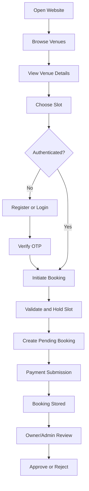
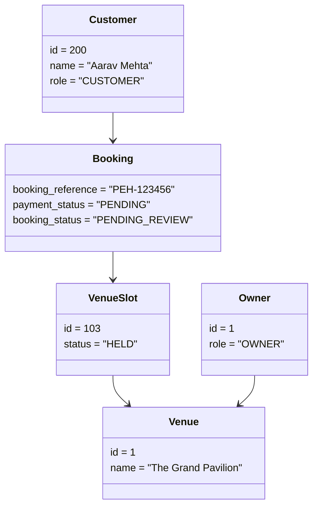
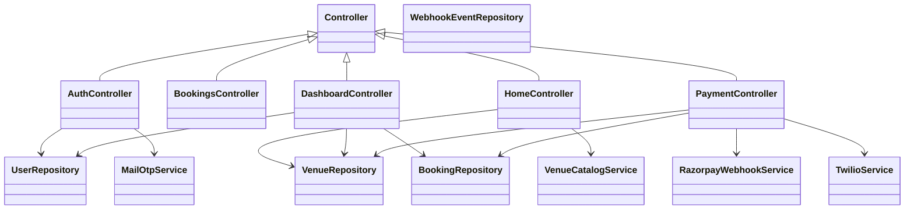
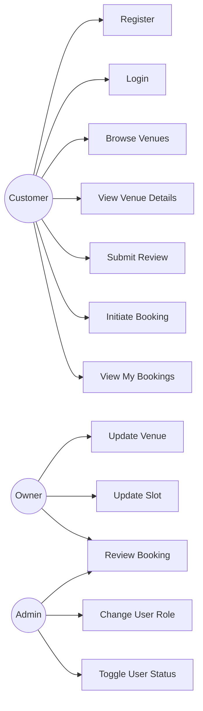
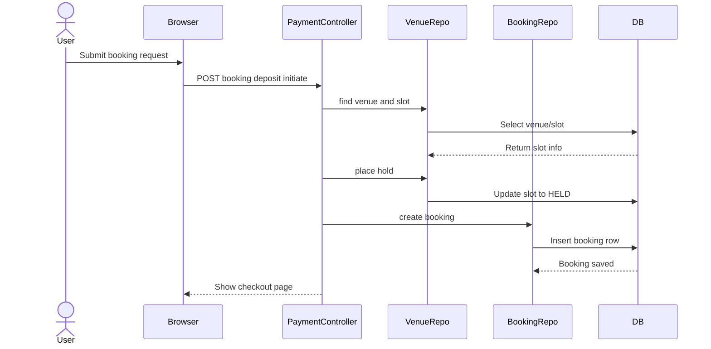
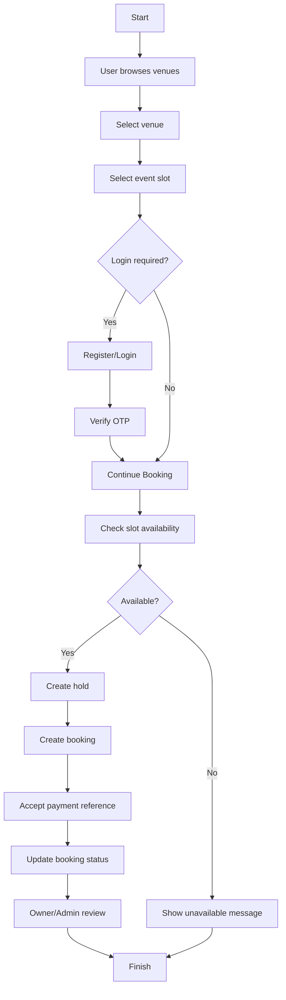
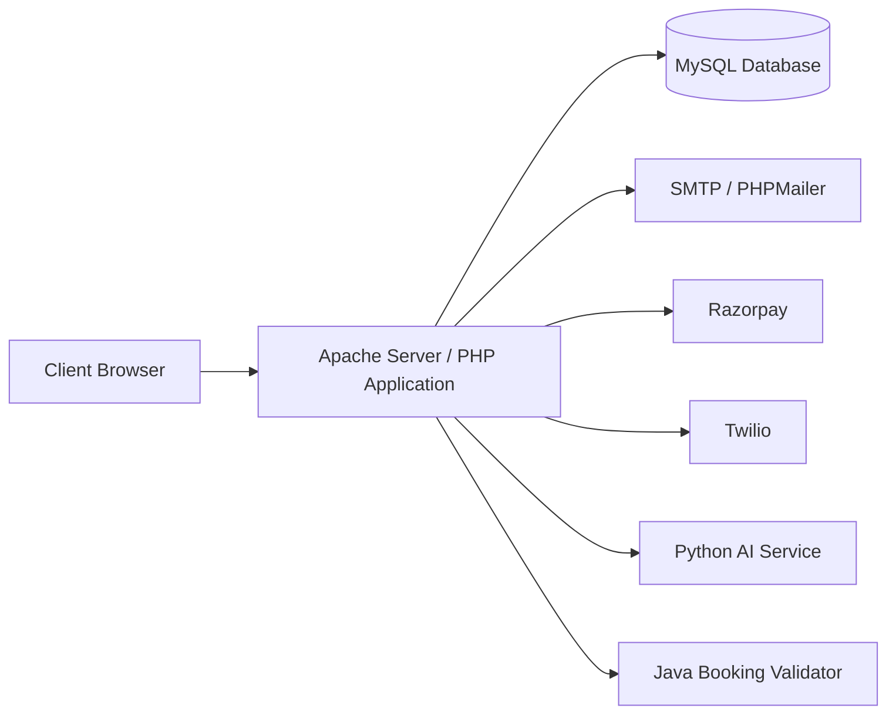
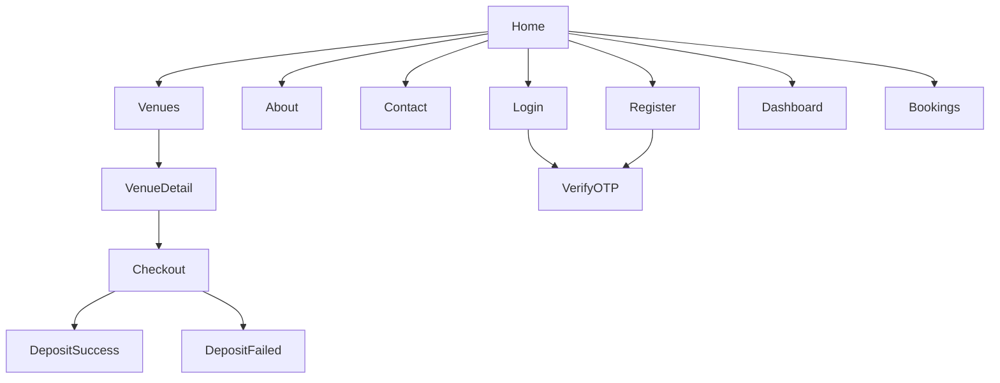
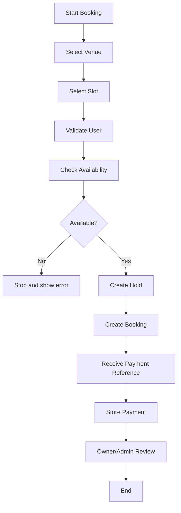

# EMS2 Project Report

## INDEX

### CHAPTER 1: INTRODUCTION

- 1.1 Introduction
- 1.2 Existing System and Need for the System
- 1.3 Scope of Work
- 1.4 Operating Environment - Hardware and Software
- 1.5 Detail Description of the Technology Used

### CHAPTER 2: SOFTWARE REQUIREMENT SPECIFICATION AND PROPOSED SYSTEM

- 2.1 Proposed System
- 2.2 Objectives of System
- 2.3 User Requirements
- 2.3.1 Overall Description
- 2.3.2 Specific Requirements
- 2.3.3 Other Non-functional Requirements

### CHAPTER 3: ANALYSIS AND DESIGN

- 3.1 System Flow Diagram (CLD / System Level Use Case)
- 3.2 Object Diagram
- 3.3 List of Classes and Class Diagram
- 3.4 List of Use Cases and Use Case Diagrams
- 3.5 Sequence Diagram
- 3.6 Activity Diagram
- 3.7 Deployment Diagram
- 3.8 Website Map Diagram

### CHAPTER 4: IMPLEMENTATION AND USER MANUAL

- 4.1 User Interface Design
- 4.2 Program Specifications / Flow Charts
- 4.3 Code Snippet (Database Connectivity)
- 4.4 Test Procedures, Test Cases and Implementation
- 4.5 User Manual
- 4.6 Operations Manual / Menu Explanation

### OTHER SECTIONS

- Drawbacks and Limitations of Proposed System
- Enhancements
- Conclusions
- Bibliography

### ANNEXURES

- Annexure 1: Input Forms with Data
- Annexure 2: Output Reports with Data
- Annexure 3: Sample Code

---

## CHAPTER 1: INTRODUCTION

## 1.1 Introduction

- EMS2 is a web-based Event Management System designed to simplify venue discovery, booking, and management.
- The system helps customers search for venues, check availability, place bookings, and track payment and approval status.
- It also supports venue owners by allowing them to manage venue details, event slots, and booking requests.
- Administrators can monitor platform activities, manage users, and supervise booking operations.
- The project combines a PHP web application, MySQL database, and integrated support services for payments, OTP verification, and booking validation.
- EMS2 reduces manual errors and provides a centralized platform for all stakeholders involved in event booking and venue management.

## 1.2 Existing System and Need for the System

### Existing System

- In many places, venue booking is still managed manually through phone calls, in-person visits, paper records, or informal chat applications.
- Customers must contact multiple venue owners to compare prices, availability, and facilities.
- Booking records are often maintained in notebooks, spreadsheets, or disconnected systems.
- Availability conflicts may occur because of delayed updates or poor coordination.
- Customers have limited transparency about booking status and payment confirmation.
- Owners spend significant time answering repetitive availability and pricing questions.

### Need for the Proposed System

- A centralized digital platform is needed to reduce manual effort in venue booking.
- Customers need faster venue discovery and better visibility into pricing, reviews, and availability.
- Owners need a structured way to manage venues, slots, and booking requests.
- Admins need a system to control user roles, monitor platform operations, and manage service quality.
- The system should prevent duplicate bookings by using controlled slot-hold logic.
- The system should improve user convenience through OTP-based login and simple booking workflows.

## 1.3 Scope of Work

- To design and develop a complete event venue booking platform.
- To allow customers to browse and compare available venues.
- To provide OTP-based customer registration and login.
- To allow customers to select dates and initiate a booking deposit.
- To provide role-based dashboards for customer, owner, and admin.
- To maintain booking, venue, review, and payment-related information in a MySQL database.
- To support booking approval and rejection by owners or administrators.
- To maintain review records for venues.
- To provide a scalable structure that can later integrate AI recommendations and advanced payment modules.

## 1.4 Operating Environment - Hardware and Software

### Hardware Requirements

- Processor: Intel Core i3 or above
- RAM: Minimum 4 GB, recommended 8 GB
- Hard Disk: Minimum 20 GB free space
- Display: Standard monitor
- Internet: Required for payment and external integrations

### Software Requirements

- Operating System: Windows 10 or above
- Web Server: XAMPP Apache
- Database Server: MySQL
- Backend Language: PHP
- Frontend Technologies: HTML, CSS, JavaScript
- Development Tools: VS Code or similar IDE
- Browser: Google Chrome / Microsoft Edge
- Optional Services: Twilio, SMTP mail service, Razorpay, Python AI service, Java validator

## 1.5 Detail Description of the Technology Used

### PHP

- PHP is used as the primary backend programming language.
- It handles routing, session management, form processing, business logic, and dynamic page rendering.
- In this project, PHP controllers coordinate the interaction between views, repositories, and services.

### MySQL

- MySQL is used as the relational database management system.
- It stores users, venues, images, slots, bookings, reviews, and webhook events.
- It provides consistency and structured data access for the application.

### HTML

- HTML is used to create the structure of the web pages.
- It defines forms, tables, navigation menus, and page layout components.

### CSS

- CSS is used to style the interface and improve the visual design.
- It supports layout formatting, typography, responsiveness, and component styling.

### JavaScript

- JavaScript is used for client-side interactions and UI behavior.
- It enhances page responsiveness and user experience.

### XAMPP

- XAMPP provides a local environment containing Apache, PHP, and MySQL.
- It is used to run and test the web application in development.

### PHPMailer / SMTP

- PHPMailer is used to send OTP emails to users during login and registration.
- It improves communication reliability compared with plain mail functions.

### Razorpay / Payment Integration

- The payment layer supports deposit-based booking flow.
- Booking-related payment references are stored and processed by the application.

### Twilio

- Twilio support is included for sending owner notifications on payment-related events.

### Python AI Service

- The Python module is intended for review sentiment scoring and AI-ready recommendations.
- It supports future intelligence-driven features in the platform.

### Java Booking Validator

- The Java module is intended for booking validation under concurrency.
- It helps the system support safe slot locking and scalable validation logic.

---

## CHAPTER 2: SOFTWARE REQUIREMENT SPECIFICATION AND PROPOSED SYSTEM

## 2.1 Proposed System

- The proposed system is a web-based Event Management System named EMS2.
- It allows customers to search venues, view venue details, select event slots, register/login, place booking deposits, and track booking status.
- It allows owners to manage venues, update slot availability, and review booking requests.
- It allows administrators to manage users, roles, and overall system operations.
- The system stores all operational data in a central MySQL database.
- The proposed system replaces slow and unreliable manual booking processes with a structured digital workflow.

## 2.2 Objectives of System

- To automate the venue booking process.
- To maintain customer, owner, and admin information in one system.
- To reduce manual errors in event scheduling and booking.
- To provide a user-friendly platform for event venue discovery.
- To improve communication between customers and venue managers.
- To maintain secure and reliable records of bookings and reviews.
- To provide role-based access and functionality.
- To support future enhancements such as AI recommendations and better payment automation.

## 2.3 User Requirements

## 2.3.1 Overall Description

- The system is intended for three main user groups: customer, owner, and administrator.
- Customers require a simple interface for searching venues and making bookings.
- Owners require tools for maintaining venue listings and reviewing reservations.
- Administrators require controls for managing users and monitoring the whole system.
- The platform must be browser-accessible and easy to use without advanced technical knowledge.

## 2.3.2 Specific Requirements

### Customer Requirements

- The customer should be able to view the home page.
- The customer should be able to browse the venue list.
- The customer should be able to open venue details.
- The customer should be able to register using name, email, phone number, and role.
- The customer should be able to log in using OTP verification.
- The customer should be able to select a date and initiate a booking.
- The customer should be able to view booking status.
- The customer should be able to submit a venue review.

### Owner Requirements

- The owner should be able to log in.
- The owner should be able to access the owner dashboard.
- The owner should be able to update venue details.
- The owner should be able to update slot details and availability.
- The owner should be able to review and decide pending bookings.

### Administrator Requirements

- The administrator should be able to access the admin dashboard.
- The administrator should be able to view users and booking information.
- The administrator should be able to change user roles.
- The administrator should be able to activate or deactivate users.
- The administrator should be able to monitor the operational health of the system.

## 2.3.3 Other Non-functional Requirements

### Performance Requirements

- The system should load standard pages within acceptable response time on local infrastructure.
- Database queries should be optimized for venue lookup and booking retrieval.

### Security Requirements

- User sessions should be maintained securely.
- OTP verification should be used for authentication.
- Payment webhook signatures should be verified.
- Only authorized roles should access privileged dashboard actions.

### Reliability Requirements

- The system should preserve booking and user records accurately.
- Booking slot holds should reduce conflicts between simultaneous users.

### Usability Requirements

- The interface should be easy to understand and use.
- Navigation should be simple for all major actions.

### Maintainability Requirements

- The code should follow a modular structure.
- Controllers, services, repositories, and core classes should remain separated by responsibility.

### Scalability Requirements

- The system should support future addition of more venues, users, and integrations.

---

## CHAPTER 3: ANALYSIS AND DESIGN

## 3.1 System Flow Diagram (CLD / System Level Use Case)

### Pointwise System Flow

1. User opens the EMS2 website.
2. User browses venue listings.
3. User selects a venue and views its details.
4. User chooses a preferred slot or event date.
5. If the user is not authenticated, the system redirects to login or registration.
6. OTP is generated and verified.
7. User submits booking deposit request.
8. The system validates and temporarily holds the slot.
9. Booking data is stored in the database.
10. Payment reference or payment capture updates the booking state.
11. Owner or admin reviews the booking.
12. Booking is approved or rejected.

### Diagram



## 3.2 Object Diagram

### Explanation

- A customer object interacts with a booking object.
- The booking object is linked to a venue slot object.
- The venue slot belongs to a venue object.
- The venue is managed by an owner object.



## 3.3 List of Classes and Class Diagram

### Core Classes

- `Config`
- `Controller`
- `Database`
- `Env`
- `Router`

### Controllers

- `AuthController`
- `BookingsController`
- `DashboardController`
- `HomeController`
- `PaymentController`

### Repositories

- `UserRepository`
- `VenueRepository`
- `BookingRepository`
- `WebhookEventRepository`

### Services

- `MailOtpService`
- `VenueCatalogService`
- `RazorpayWebhookService`
- `RazorpayOrderService`
- `TwilioService`
- `GoogleOAuthService`
- `BookingValidatorClient`
- `WebhookAuditService`

### Class Diagram



## 3.4 List of Use Cases and Use Case Diagrams

### List of Use Cases

1. Register account
2. Login account
3. Verify OTP
4. Browse venues
5. View venue details
6. Submit review
7. Initiate booking
8. View booking history
9. Update venue
10. Update slot
11. Approve booking
12. Reject booking
13. Change user role
14. Toggle user status

### Use Case Diagram



## 3.5 Sequence Diagram



## 3.6 Activity Diagram



## 3.7 Deployment Diagram



## 3.8 Website Map Diagram



---

## CHAPTER 4: IMPLEMENTATION AND USER MANUAL

## 4.1 User Interface Design

### Main Screens Included

- Home Page
- Venues Listing Page
- Venue Detail Page
- Login Page
- Registration Page
- OTP Verification Page
- Dashboard Page
- Booking Page
- Deposit Success Page
- Deposit Failure Page

### UI Design Points

- The home page introduces the system and highlights featured venues.
- The venues page shows all venues in a browsing-friendly format.
- The venue detail page provides images, price, slot, owner-related context, and reviews.
- Login and register pages are simple and form-based.
- OTP page confirms authentication before granting access.
- Dashboard layout changes according to role: customer, owner, or admin.
- The interface is designed for clarity, accessibility, and smooth user navigation.

## 4.2 Program Specifications / Flow Charts

### Module 1: Authentication Module

- Accepts registration or login input.
- Generates OTP.
- Stores OTP in session.
- Verifies OTP.
- Creates or authenticates user.

### Module 2: Venue Management Module

- Fetches venue data from the database.
- Shows venues to users.
- Allows owners/admins to update venue details.

### Module 3: Booking Module

- Accepts venue and date selection.
- Resolves or creates slot.
- Places temporary hold.
- Creates pending booking record.
- Waits for payment confirmation.

### Module 4: Review Module

- Accepts user review text and rating.
- Validates minimum review length.
- Stores review in database.

### Module 5: Dashboard Module

- Loads data based on role.
- Customer sees personal actions and bookings.
- Owner sees venue operations and booking approvals.
- Admin sees user controls and operational overview.

### Booking Flow Chart



## 4.3 Code Snippet (Database Connectivity)

### Sample Database Connectivity Code

```php
<?php

declare(strict_types=1);

namespace App\Core;

use PDO;

final class Database
{
    private static ?PDO $connection = null;

    public static function connection(): PDO
    {
        if (self::$connection instanceof PDO) {
            return self::$connection;
        }

        $config = Config::get('services.database', []);
        $dsn = sprintf(
            'mysql:host=%s;port=%s;dbname=%s;charset=%s',
            $config['host'] ?? '127.0.0.1',
            $config['port'] ?? '3306',
            $config['name'] ?? 'pune_event_hub',
            $config['charset'] ?? 'utf8mb4'
        );

        self::$connection = new PDO(
            $dsn,
            $config['username'] ?? 'root',
            $config['password'] ?? '',
            [
                PDO::ATTR_ERRMODE => PDO::ERRMODE_EXCEPTION,
                PDO::ATTR_DEFAULT_FETCH_MODE => PDO::FETCH_ASSOC,
            ]
        );

        return self::$connection;
    }
}
```

### Explanation

- The `Database` class creates a reusable PDO connection.
- The class reads connection settings from configuration.
- It connects to MySQL using host, port, database name, and charset.
- It enables exception mode and associative array fetch mode.
- This class is used by repository classes for database operations.

## 4.4 Test Procedures, Test Cases and Implementation

### Test Procedure

1. Start XAMPP Apache and MySQL.
2. Import database schema and seed data.
3. Open the application in the browser.
4. Execute module-wise tests.
5. Observe output in user interface and database records.
6. Verify role-based behavior.

### Test Cases

| Test ID | Test Description | Input | Expected Output | Result |
|---|---|---|---|---|
| T1 | Register user | Name, email, phone | OTP page displayed | Pass |
| T2 | Login existing user | Email/phone | OTP page displayed | Pass |
| T3 | Invalid short review | Review below 10 chars | Validation error | Pass |
| T4 | Browse venues | Open venues page | List displayed | Pass |
| T5 | View venue detail | Valid slug | Venue details shown | Pass |
| T6 | Start booking | Valid slot | Pending booking created | Pass |
| T7 | Booking unavailable slot | Booked slot | Failure message | Pass |
| T8 | Manual payment callback | Valid booking and payment reference | Booking updated | Pass |
| T9 | Customer bookings | Logged in customer | Personal bookings shown | Pass |
| T10 | Owner updates venue | Valid venue form | Venue updated | Pass |
| T11 | Owner updates slot | Valid slot form | Slot updated | Pass |
| T12 | Admin role update | User ID and role | Role changed | Pass |
| T13 | Admin status toggle | User ID and status | Status changed | Pass |
| T14 | Approve booking | Booking reference | Booking approved | Pass |
| T15 | Reject booking | Booking reference | Booking rejected | Pass |

### Implementation Summary

- The system is implemented using a modular PHP MVC-style structure.
- Routing is handled centrally.
- Business logic is divided among controllers and services.
- Data persistence is handled through repository classes.
- The database schema supports users, venues, slots, bookings, reviews, and webhook events.

## 4.5 User Manual

### Steps for Customer

1. Open the website.
2. Click `Venues`.
3. Select a venue.
4. Read venue details and choose a date or slot.
5. Click booking-related action.
6. Register or login if required.
7. Verify OTP.
8. Submit booking payment details.
9. Open `My Bookings` to check status.
10. Submit review after interaction with the venue.

### Steps for Owner

1. Login with owner account.
2. Open `Dashboard`.
3. Review owned venues.
4. Update venue details if required.
5. Manage slot entries.
6. Review customer bookings.
7. Approve or reject bookings.

### Steps for Admin

1. Login with admin account.
2. Open `Dashboard`.
3. Review users and operations.
4. Change roles.
5. Activate or deactivate users.
6. Supervise bookings and venues.

## 4.6 Operations Manual / Menu Explanation

### Operations Manual

#### Startup Steps

1. Launch XAMPP control panel.
2. Start Apache and MySQL.
3. Ensure the project exists in `C:\xampp\htdocs\EMS2`.
4. Import SQL files if needed.
5. Open `http://localhost/EMS2/php-app/public`.

#### Monitoring and Support Steps

1. Check database connectivity if pages fail to load data.
2. Check `.env` configuration for mail and service settings.
3. Verify integration log file when payment webhook problems occur.
4. Review held slots and payment status if bookings get stuck.

### Menu Explanation

#### Public Menu

- `Home`: Landing page of the project.
- `Venues`: Displays all venue options.
- `About`: Shows project or company information.
- `Contact`: Shows contact page.
- `Login`: Opens authentication page.
- `Register`: Opens registration page.

#### User Menu

- `Dashboard`: Displays role-specific summary and actions.
- `My Bookings`: Shows booking history and status.

#### Owner/Admin Dashboard Sections

- `Overview`: Summary metrics.
- `Users`: Admin control panel for users.
- `Venue Ops`: Venue administration section.
- `Bookings`: Review and manage bookings.
- `My Venues`: Owner-specific venue management.
- `Upcoming`: Upcoming reservations.
- `Past`: Previous reservations.
- `Availability`: Slot management section.

---

## DRAWBACKS AND LIMITATIONS OF THE PROPOSED SYSTEM

- The system currently depends on local hosting configuration for development use.
- OTP delivery depends on correct email configuration.
- Payment flow may require manual confirmation in some cases.
- Real-time concurrency protection can be further strengthened using the external validator service.
- Some advanced analytics and reporting features are not yet fully implemented.
- Offline use is not supported.
- Internet-based integrations may fail if third-party services are unavailable.

## ENHANCEMENTS

- Add full online payment automation and reconciliation.
- Add live notifications for customers and owners.
- Add search filters by location, price, event type, and capacity.
- Add AI-based venue recommendation features.
- Add file upload for venue images through dashboard.
- Add booking cancellation and refund workflow.
- Add exportable reports for admins.
- Add stronger audit trails and analytics dashboards.
- Add mobile app support in future versions.

## CONCLUSIONS

- EMS2 successfully demonstrates a digital solution for event venue booking and management.
- The project reduces manual communication and record-keeping effort.
- It provides a structured workflow for customers, owners, and administrators.
- The modular design supports future enhancement and integration.
- The system is suitable as an academic mini-project or major project because it includes database design, authentication, role-based modules, booking flow, and user-facing pages.

## BIBLIOGRAPHY

- PHP Official Documentation
- MySQL Official Documentation
- Apache / XAMPP Documentation
- HTML and CSS Reference Material
- JavaScript Reference Material
- PHPMailer Documentation
- Razorpay API Documentation
- Twilio API Documentation
- Software Engineering and UML reference books

---

## ANNEXURE 1: INPUT FORMS WITH DATA

### Registration Form

- Full Name: Aarav Mehta
- Email: aarav@puneeventhub.local
- Phone Number: 9876543210
- Role: Customer

### Login Form

- Identity: aarav@puneeventhub.local

### Review Form

- Rating: 5
- Review Text: The venue looked beautiful and the booking process was smooth.

### Booking Form

- Venue Slug: grand-pavilion
- Event Date: 2026-06-10
- Event Time: 09:00
- Guest Count: 300
- Occasion: Wedding
- Notes: Need floral stage setup

## ANNEXURE 2: OUTPUT REPORTS WITH DATA

### Sample Booking Output

- Booking Reference: PEH-123456
- Customer Name: Aarav Mehta
- Venue Name: The Grand Pavilion
- Payment Status: PENDING / DEPOSIT_PAID
- Booking Status: PENDING_REVIEW / APPROVED

### Sample Dashboard Output

- Registered Customers: Visible to admin
- Active Owners: Visible to admin
- Total Bookings: Visible to owner
- Pending Reviews: Visible to owner

### Sample Review Output

- Reviewer: Aarav Mehta
- Rating: 5
- Review: The venue looked beautiful and the booking process was smooth.

## ANNEXURE 3: SAMPLE CODE

### Routing Sample

```php
return [
    ['GET', '/', [HomeController::class, 'index']],
    ['GET', '/venues', [HomeController::class, 'venues']],
    ['GET', '/venues/{slug}', [HomeController::class, 'showVenue']],
    ['POST', '/bookings/deposit/initiate', [PaymentController::class, 'initiateDeposit']],
];
```

### Review Submission Sample

```php
public function submitReview(array $params): void
{
    $slug = (string) ($params['slug'] ?? '');
    $repository = new VenueRepository();
    $venue = $repository->findBySlug($slug);

    $rating = max(1, min(5, (int) ($_POST['rating'] ?? 0)));
    $reviewText = trim((string) ($_POST['review_text'] ?? ''));

    $repository->createReview((int) ($venue['venue_id'] ?? 0), (int) $user['id'], $rating, $reviewText);
}
```

### Booking Creation Sample

```php
$booking = $bookingRepository->createPending([
    'user_id' => $currentUser['id'],
    'venue_slot_id' => (int) $selectedSlot['id'],
    'booking_reference' => $bookingReference,
    'hold_reference' => $holdReference,
    'total_amount' => $venue['totalAmount'],
    'deposit_amount' => $confirmationFee,
    'venue_name' => $venue['name'],
    'owner_phone' => $venue['ownerPhone'],
]);
```

---

## FINAL NOTE

- This report content is based on the current EMS2 codebase.
- Screenshots can be inserted later under section 4.1 and annexures.
- If needed, this report can be converted into a college-style Word document with page formatting, certificate, acknowledgement, abstract, and table of contents.
