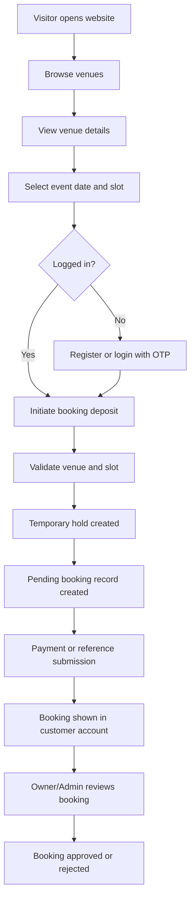
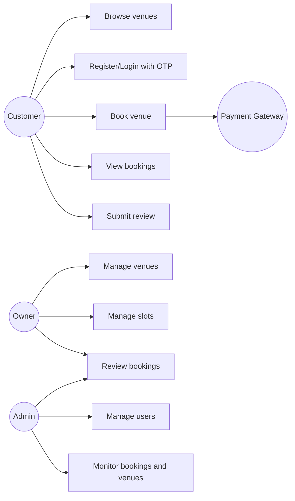
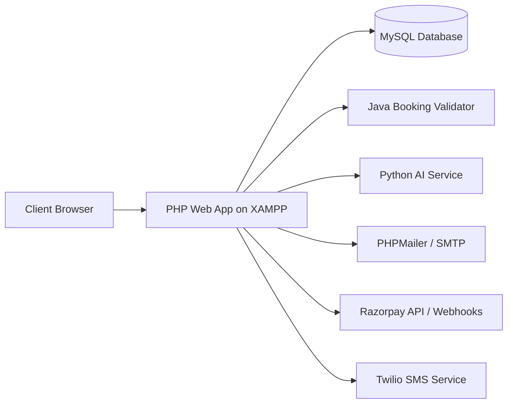
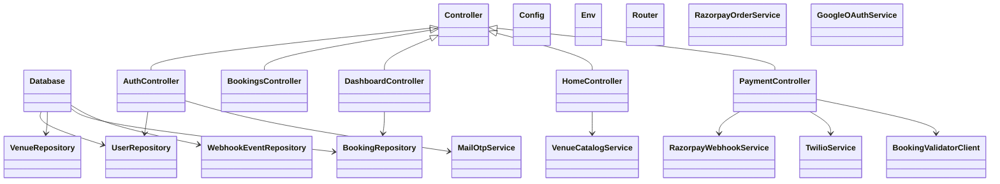
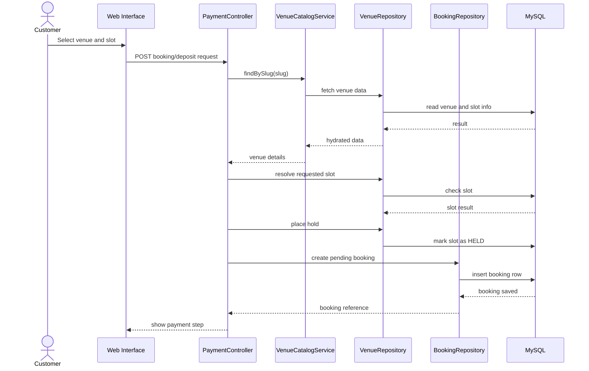
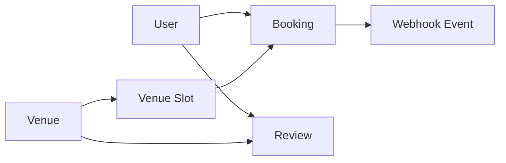
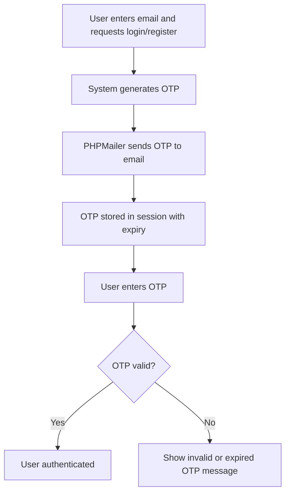
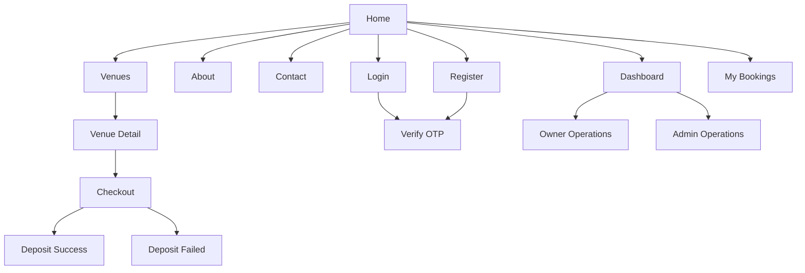

# EMS2 Project Explanation Script with Diagrams

## Title

**EMS2: Event and Venue Management System**

## How to Use This Script

- Use this as a 5 to 8 minute presentation script.
- Read the speaker lines directly during viva, demo, or project explanation.
- Mermaid diagrams can be pasted into Markdown viewers, GitHub, or Mermaid Live Editor to export images.

---

## 1. Opening Introduction

### Speaker Script

Good morning everyone.  
Our project is **EMS2**, which stands for **Event and Venue Management System**.  
This project is designed to solve a common real-world problem in venue booking.

In many cases, customers still book venues through phone calls, WhatsApp messages, or manual registers. Because of that, the process becomes slow, confusing, and error-prone. Customers struggle to compare venues and check availability, while owners struggle to manage multiple booking requests and schedules.

To solve this, we built a web-based platform where customers can browse venues, view slot availability, log in using OTP, initiate bookings, and track booking status. At the same time, owners and administrators can manage venues, slots, users, and booking approvals from role-based dashboards.

Our system is modular and uses multiple technologies:

- A **PHP web application** for the main website and dashboard
- A **MySQL database** for storing users, venues, slots, bookings, and reviews
- A **Java booking validator** for safer booking validation under concurrency
- A **Python AI module** for review sentiment scoring
- Integration-ready support for **PHPMailer**, **Razorpay**, and **Twilio**

So overall, EMS2 is not just a website. It is a complete platform for venue discovery, booking, validation, and management.

---

## 2. Problem Statement

### Speaker Script

The main problem we identified is that traditional venue booking is often manual and unstructured.

- Customers do not get a centralized place to compare venues
- Owners may accidentally accept overlapping bookings
- Booking tracking is weak
- Reviews and feedback are not organized properly
- Admin monitoring is difficult when records are spread across different sources

Our project addresses these issues by creating one centralized digital workflow.

---

## 3. Objectives of the Project

### Speaker Script

The main objectives of EMS2 are:

- To digitize the venue booking process
- To provide OTP-based user authentication
- To help customers browse and book venues easily
- To help owners manage venues and slot availability
- To help administrators monitor platform activity
- To reduce booking conflicts using structured validation and slot holds
- To maintain all important records inside a centralized MySQL database

---

## 4. High-Level System Flow

### Speaker Script

Now I will explain the overall workflow of the system.

First, a visitor opens the website and browses available venues.  
Then the user opens a venue detail page, selects a date and slot, and proceeds to booking.  
If the user is not logged in, the system asks for login or registration using OTP verification.  
After authentication, the user initiates the booking deposit.  
The system checks the slot, creates a temporary hold, creates a pending booking record, and then continues with payment-related flow.  
Finally, the booking becomes visible in the user account, and the owner or admin can review and approve or reject it.

### Diagram: System Flow

---

## 5. Main Users of the System

### Speaker Script

Our system has three major user roles.

The first role is the **Customer**.  
The customer can browse venues, register, log in using OTP, initiate a booking, view booking history, and submit reviews.

The second role is the **Owner**.  
The owner can manage venues, manage slots, and review customer bookings.

The third role is the **Admin**.  
The admin can monitor users, change roles, manage platform activity, and also supervise bookings.

### Diagram: Use Case Overview

---

## 6. Architecture Explanation

### Speaker Script

Now I will explain the project architecture.

The core web application is developed in PHP.  
This PHP application handles routing, sessions, page rendering, controllers, repositories, and service classes.

The PHP app communicates with a MySQL database where all major records are stored, such as users, venues, slots, bookings, reviews, and webhook events.

Along with that, our system includes two supporting modules:

- A **Java booking validator**, which is designed to validate bookings safely when multiple users try to book the same slot
- A **Python AI service**, which can score review sentiment and support recommendation-ready features

The system is also designed to support external services like:

- **PHPMailer / SMTP** for OTP email delivery
- **Razorpay** for deposit and payment flow
- **Twilio** for owner SMS notifications

### Diagram: Deployment / Architecture

---

## 7. Internal PHP Application Design

### Speaker Script

Inside the PHP application, the code follows a modular structure.

- **Controllers** handle requests and user actions
- **Repositories** handle database operations
- **Services** handle business logic and integrations
- **Core classes** handle configuration, routing, environment loading, and database access

For example:

- `AuthController` manages login, registration, and OTP verification
- `BookingsController` handles booking-related actions
- `DashboardController` manages owner and admin dashboard features
- `MailOtpService` sends OTP emails
- `BookingValidatorClient` connects with the validator module
- `RazorpayWebhookService` handles payment webhook logic

This structure improves maintainability because each class has a clear responsibility.

### Diagram: Class-Level View

---

## 8. Booking Sequence Explanation

### Speaker Script

This is one of the most important flows in our project, so I will explain it step by step.

When a customer selects a venue and slot, the request goes to the booking or payment-related controller in the PHP application.  
The system fetches the venue data and resolves the requested slot.  
Then it checks availability and places a local hold.  
After that, it creates a pending booking record in the database.  
Only after those steps does the system proceed toward payment handling.  
This design helps reduce conflicts and keeps the booking flow controlled.

### Diagram: Booking Sequence

---

## 9. Database Explanation

### Speaker Script

The database is a central part of our project.

It stores:

- user details
- venue details
- venue images
- slot schedules
- bookings
- customer reviews
- payment webhook events

The database is designed using MySQL and supports record consistency through structured tables and relationships.  
This is important because venue booking depends on accurate slot data, user identity, and booking history.

### Diagram: Simplified Entity Relationship View

---

## 10. Authentication and OTP Flow

### Speaker Script

For authentication, we use an OTP-based approach instead of a traditional password-heavy flow.

When a user tries to register or log in, the system sends a one-time password to the user email using PHPMailer.  
The OTP is stored temporarily in session with an expiry time.  
After verification, the user is allowed to continue to booking or dashboard access.

This method simplifies login for demo and academic use, and it also makes the flow easy to explain during project presentation.

### Diagram: OTP Flow

---

## 11. Website Navigation Explanation

### Speaker Script

The website is designed so that the user can move through the system in a simple order.

The home page leads to venue browsing, login, registration, dashboard access, and booking pages.  
After selecting a venue, the user can move to the detail page and then to checkout.  
Dashboard pages differ according to role.

### Diagram: Website Map

---

## 12. Key Features

### Speaker Script

The major features of our project are:

- Venue browsing and detail viewing
- OTP-based registration and login
- Role-based access for customer, owner, and admin
- Slot-based booking workflow
- Pending, approved, and rejected booking states
- Review submission for venues
- Payment event handling support
- Admin and owner dashboards
- Modular architecture for future extension

In addition, the project is designed so that more advanced features such as AI recommendations, stronger payment automation, and better booking conflict handling can be added later.

---

## 13. Advantages of the Proposed System

### Speaker Script

The advantages of EMS2 are:

- It reduces manual booking effort
- It centralizes all venue and booking information
- It improves transparency for customers
- It helps owners manage availability and requests more efficiently
- It supports organized admin supervision
- It is modular, so future enhancements are easier to implement

---

## 14. Limitations

### Speaker Script

Like any academic project, our system also has some current limitations.

- Some external integrations require real credentials to run fully in production mode
- Advanced cancellation and refund workflows are not the primary focus yet
- Large-scale analytics and recommendation engines are still future enhancements
- Some modules are designed for extensibility and can be expanded further

These limitations also create opportunities for future improvement.

---

## 15. Future Enhancements

### Speaker Script

In future versions, we can enhance the system by adding:

- stronger real-time slot locking
- cancellation and refund workflows
- AI-based venue recommendation
- advanced dashboards and reports
- notification history tracking
- mobile app support
- improved payment reconciliation

These enhancements can make EMS2 more production-ready and scalable.

---

## 16. Conclusion

### Speaker Script

To conclude, EMS2 is a modular event and venue management platform that helps customers, venue owners, and administrators work within a single digital system.

It replaces manual booking methods with a structured workflow that includes venue discovery, OTP-based login, booking initiation, slot validation, and dashboard-based management.

Technically, the project demonstrates integration of multiple technologies including PHP, MySQL, Java, Python, and external service support.  
From a software engineering perspective, it also demonstrates analysis, design, modular implementation, and future extensibility.

So in summary, EMS2 is a practical and scalable academic project that addresses a real-world event booking problem in a structured and modern way.

Thank you.

---

## 17. Short Viva Version

### Speaker Script

EMS2 is a web-based event and venue management system.  
It allows customers to browse venues, select slots, log in using OTP, and initiate bookings.  
Owners can manage venues and booking requests, while admins monitor users and platform activity.

The main application is built in PHP with a MySQL database.  
We also included a Java validator for booking concurrency and a Python module for AI-based review sentiment scoring.  
The system is modular and integration-ready for email OTP, payment workflow, and SMS notifications.

The main benefit of the system is that it replaces manual venue booking with a centralized digital workflow that is easier to manage, more transparent, and more scalable.

---

## 18. Demo Flow You Can Speak While Showing the Project

### Speaker Script

First, I open the home page of EMS2.  
From here, a user can go to the venue listing page and browse available venues.

Next, I open a venue detail page.  
Here the user can see venue information, reviews, and available slot-related details.

If the user wants to continue, they can log in or register using OTP verification.  
Once authenticated, the user can proceed with booking initiation.

After the booking request is submitted, the system validates the slot, creates a pending booking, and moves toward payment handling.

Then the user can view booking status in their account, while the owner or admin can review the booking from the dashboard.

This demonstrates the main end-to-end flow of the project.
