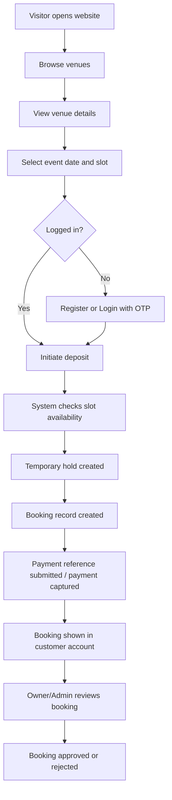
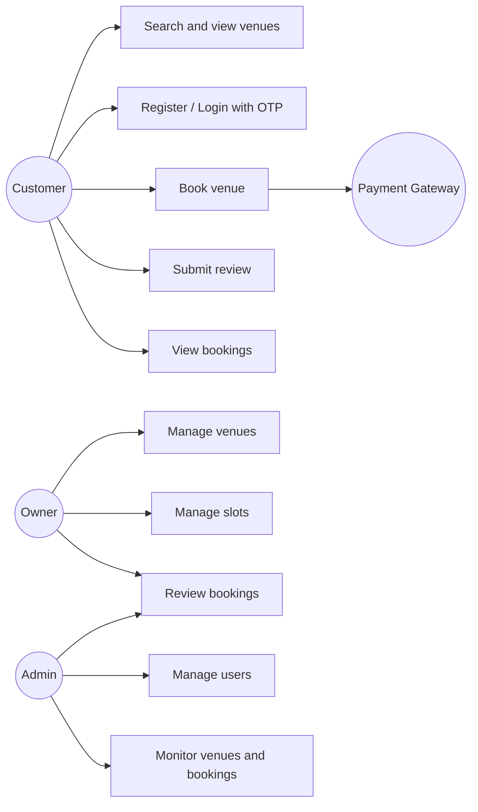
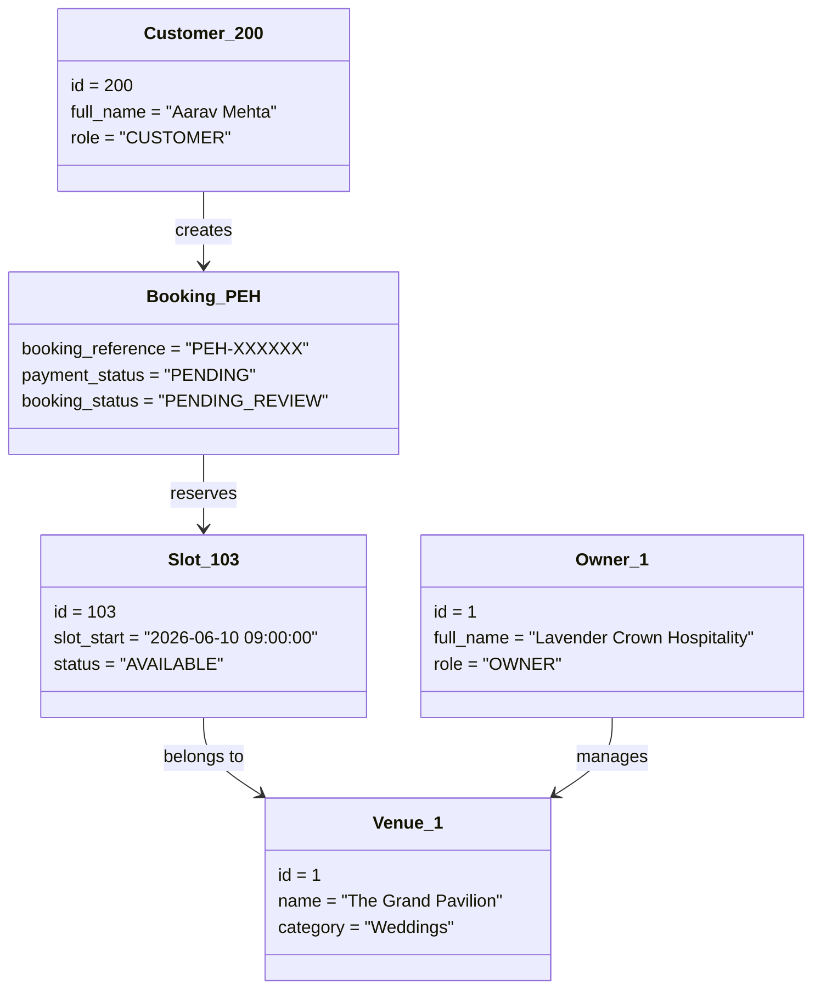
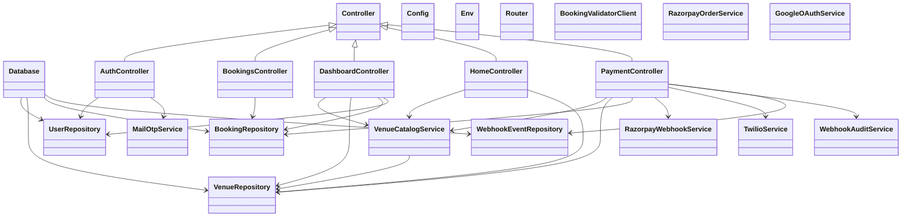
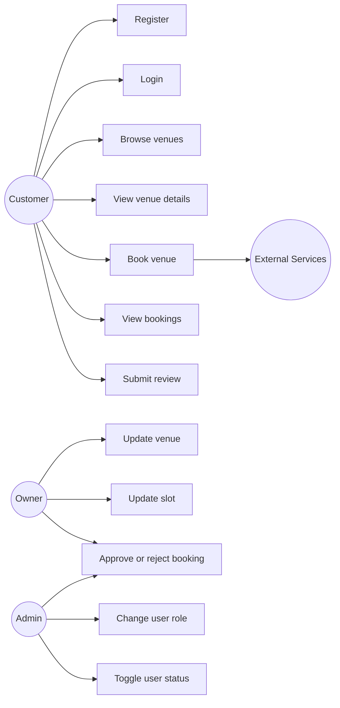
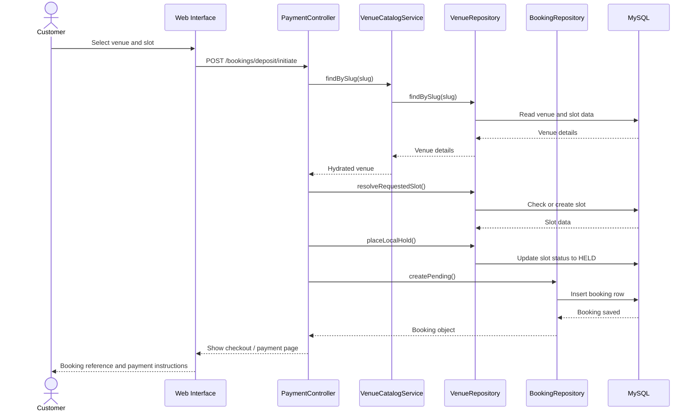
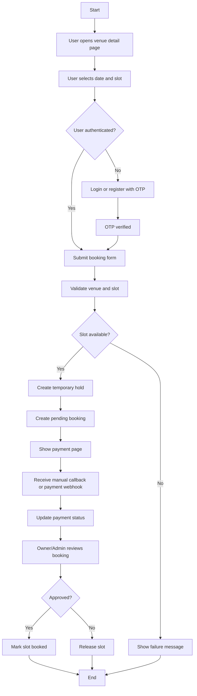
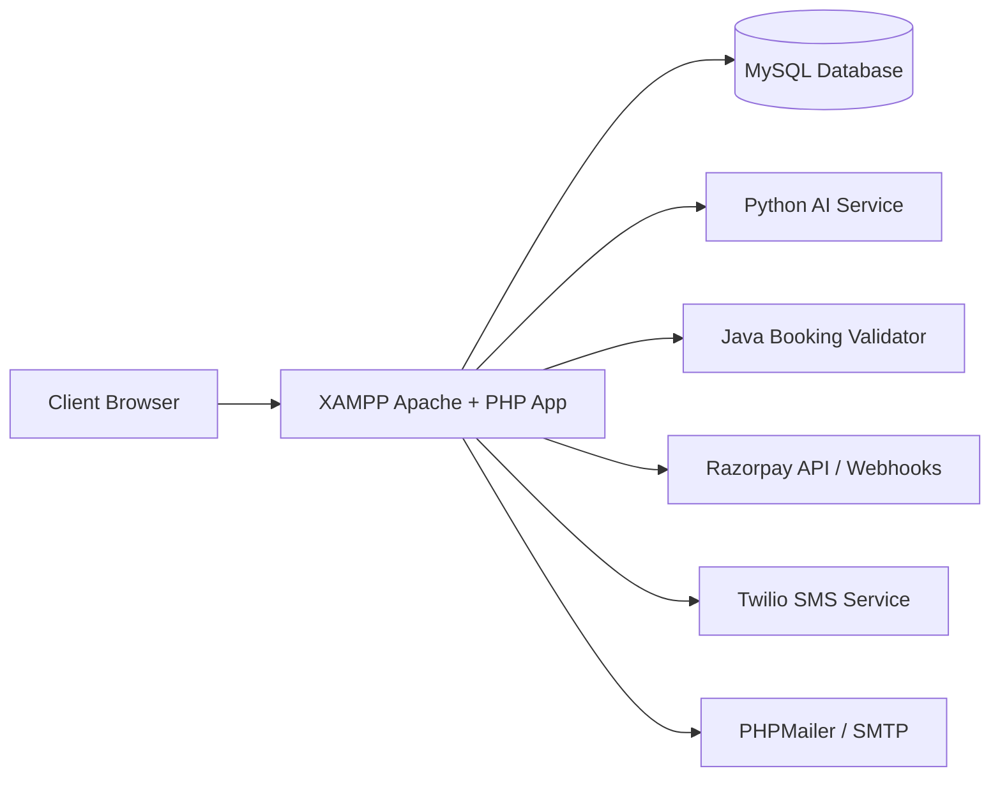
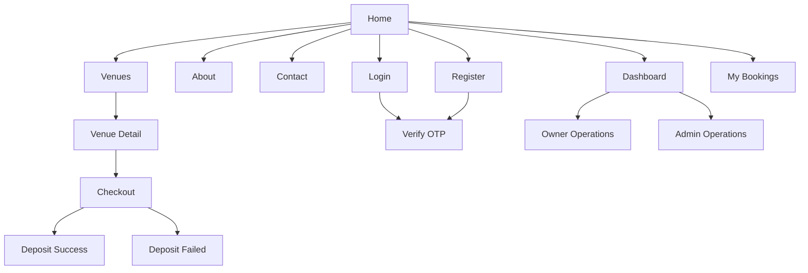

# EMS2 Project Report Sections

## 3.1 System Flow Diagram (CLD / System Level Use Case)

### System Flow Summary

The EMS2 system is a web-based event and venue management platform. A customer visits the website, browses venues, views venue details, selects an available date and time slot, logs in or registers using OTP verification, and submits a booking deposit. The system stores booking data in MySQL, manages slot availability, and supports booking review by venue owners or administrators. Owners manage venue information, slots, and booking approvals through the dashboard. Administrators monitor users, owners, venues, and booking operations.

### System Level Use Case

### System Level Use Case Diagram

## 3.2 Object Diagram

The object diagram below shows a sample runtime snapshot of the system during a booking flow.

## 3.3 List of Classes and Class Diagram

### List of Main Classes

#### Core Classes

- `Config`
- `Controller`
- `Database`
- `Env`
- `Router`

#### Controller Classes

- `AuthController`
- `BookingsController`
- `DashboardController`
- `HomeController`
- `PaymentController`

#### Repository Classes

- `BookingRepository`
- `UserRepository`
- `VenueRepository`
- `WebhookEventRepository`

#### Service Classes

- `BookingValidatorClient`
- `GoogleOAuthService`
- `MailOtpService`
- `RazorpayOrderService`
- `RazorpayWebhookService`
- `TwilioService`
- `VenueCatalogService`
- `WebhookAuditService`

### Class Diagram

## 3.4 List of Use Cases and Use Case Diagrams

### List of Use Cases

1. User registration using OTP
2. User login using OTP
3. Browse venue catalog
4. View venue details and reviews
5. Submit venue review
6. Initiate venue booking deposit
7. View personal bookings
8. Owner updates venue details
9. Owner updates slot availability
10. Owner reviews booking requests
11. Admin changes user roles
12. Admin activates or deactivates users
13. System records payment webhook events

### Use Case Diagram

## 3.5 Sequence Diagram

### Booking Sequence Diagram

## 3.6 Activity Diagram

### Booking Activity Diagram

## 3.7 Deployment Diagram

The EMS2 system is deployed as a multi-module environment. The PHP web application runs on XAMPP Apache/PHP, the database uses MySQL, and optional external integrations include Twilio and Razorpay. The architecture also includes a Python service for AI review scoring and a Java service for booking validation.

## 3.8 Web Site Map Diagram

## 4.4 Test Procedures, Test Cases and Implementation

### Test Procedure

The testing process for EMS2 is based on functional testing, integration testing, and user interface verification. Each major module was executed independently and then tested as part of the complete workflow. The procedure used for testing is:

1. Start Apache and MySQL using XAMPP.
2. Import `database/schema.sql` and `database/seed_demo.sql`.
3. Open the application through `http://localhost/EMS2/php-app/public`.
4. Test registration and login using OTP-based authentication.
5. Test venue browsing and venue detail pages.
6. Test booking flow with slot selection and deposit initiation.
7. Test owner and admin dashboard actions.
8. Test booking review and slot status updates.
9. Test review submission and booking history display.

### Test Cases

| Test Case ID | Module | Test Scenario | Input | Expected Result | Status |
|---|---|---|---|---|---|
| TC01 | Authentication | Register a new customer | Name, email, phone, role | OTP page is displayed and user is created after verification | Pass |
| TC02 | Authentication | Login using registered email | Valid email/phone | OTP verification page is displayed | Pass |
| TC03 | Authentication | Login with inactive user | Inactive account credentials | Login is denied with warning message | Pass |
| TC04 | Venue Catalog | View all venues | Open `/venues` | Venue list is displayed from database | Pass |
| TC05 | Venue Details | Open a venue detail page | Valid venue slug | Venue details, slots, and reviews are shown | Pass |
| TC06 | Reviews | Submit valid review | Rating and review text | Review is saved and success message appears | Pass |
| TC07 | Reviews | Submit short review | Text less than 10 chars | Review is rejected with validation error | Pass |
| TC08 | Booking | Initiate booking with valid slot | Valid slot date/time | Hold is placed and pending booking is created | Pass |
| TC09 | Booking | Initiate booking with unavailable slot | Booked slot date/time | Failure page is displayed | Pass |
| TC10 | Payment | Submit valid manual payment reference | Booking reference and UTR | Receipt is stored and success page opens | Pass |
| TC11 | Booking History | View customer bookings | Logged in customer | Bookings list is shown from DB | Pass |
| TC12 | Owner Dashboard | Update venue details | Venue form data | Venue information is updated | Pass |
| TC13 | Owner Dashboard | Update slot status | Slot form data | Slot details are updated | Pass |
| TC14 | Booking Review | Approve pending booking | Valid booking reference | Booking status becomes APPROVED | Pass |
| TC15 | Booking Review | Reject pending booking | Valid booking reference | Booking status becomes REJECTED and slot is released | Pass |
| TC16 | Admin Operations | Change user role | User ID and new role | User role is updated in database | Pass |
| TC17 | Admin Operations | Toggle user status | User ID and status | User becomes active/inactive | Pass |
| TC18 | Webhook | Receive valid webhook | Signed Razorpay payload | Event is logged and booking payment is updated | Pass |

### Test Implementation

The system was implemented and tested using the following approach:

- Front-end pages were tested manually through the browser.
- PHP controllers were verified through route-level execution.
- Database operations were validated against MySQL records.
- Booking and payment flow were checked using seeded demo data.
- Owner and admin operations were verified with role-based test accounts.
- Review submission was validated using both success and error conditions.

## 4.5 User Manual

### Introduction

EMS2 allows customers to discover venues, book them, and track their booking status. Owners can manage their venues and booking requests, while administrators monitor the complete system.

### How to Use the System

#### For Customers

1. Open the home page.
2. Click `Venues` to browse available venues.
3. Select any venue to view its full details, images, reviews, and available slots.
4. If you want to book a venue, choose the required date and time.
5. If not logged in, use `Login` or `Register`.
6. Enter the OTP received through email and verify it.
7. Continue to the booking payment page.
8. Submit the payment reference.
9. Open `My Bookings` or `Dashboard` to view booking status.
10. Add a review from the venue detail page after using the service.

#### For Owners

1. Log in using owner credentials.
2. Open `Dashboard`.
3. Review venue details and update listing information.
4. Manage event slots and availability.
5. View booking requests submitted by customers.
6. Approve or reject bookings.

#### For Administrators

1. Log in using admin credentials.
2. Open `Dashboard`.
3. Monitor all users, owners, venues, and booking activity.
4. Change user roles when required.
5. Activate or deactivate users.
6. Review overall marketplace operations.

### Demo Accounts

Example demo users are included in the seed data:

- Admin: `admin@puneeventhub.local`
- Owner: `owner1@puneeventhub.local`
- Customer: `aarav@puneeventhub.local`

## 4.6 Operations Manual / Menu Explanation

### Operations Manual

The operations manual describes how the system should be run and maintained by the operator or administrator.

#### Startup Procedure

1. Start Apache and MySQL from the XAMPP control panel.
2. Ensure the project folder is available at `C:\xampp\htdocs\EMS2`.
3. Import database files if the database has not yet been created.
4. Open the browser and navigate to `http://localhost/EMS2/php-app/public`.
5. Confirm that environment values in `php-app/.env` are configured correctly.

#### Database Setup

1. Create the database using `database/schema.sql`.
2. Insert demo data using `database/seed_demo.sql`.
3. Verify that users, venues, slots, bookings, and reviews are present.

#### Maintenance Tasks

1. Monitor `payment_webhook_events` for incoming payment callbacks.
2. Review the `storage/integration-events.log` file for webhook audit logs.
3. Check slot statuses for stuck `HELD` records if a booking flow is interrupted.
4. Verify SMTP, Twilio, and payment configuration when external integrations fail.

### Menu Explanation

#### Main Navigation Menu

- `Home`: Displays featured venues and introduction to the platform.
- `Venues`: Shows the full venue catalog.
- `About`: Displays platform information.
- `Contact`: Shows contact information.
- `Login`: Opens the login page.
- `Register`: Opens the new account registration page.
- `Dashboard`: Opens role-based dashboard features.
- `My Bookings`: Displays customer booking history.

#### Dashboard Menu Explanation

- `Overview`: General summary of the user dashboard.
- `Users`: Admin-only area for viewing and managing users.
- `Venue Ops`: Admin area for venue management tasks.
- `Bookings`: Admin and owner booking review area.
- `My Venues`: Owner area for venue management.
- `Upcoming`: Displays upcoming bookings.
- `Past`: Displays previous bookings.
- `Availability`: Displays or updates slot availability.

## Notes for Final Report

- This documentation is based on the current EMS2 codebase in `php-app`, `database`, and the linked service modules.
- Mermaid diagrams can be converted into screenshots for the final project report if your college format requires images instead of code blocks.
- If required, these sections can be copied into Word and renumbered to match the rest of your report.
